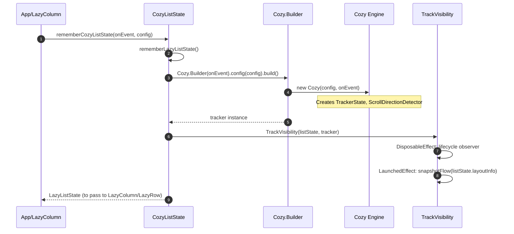
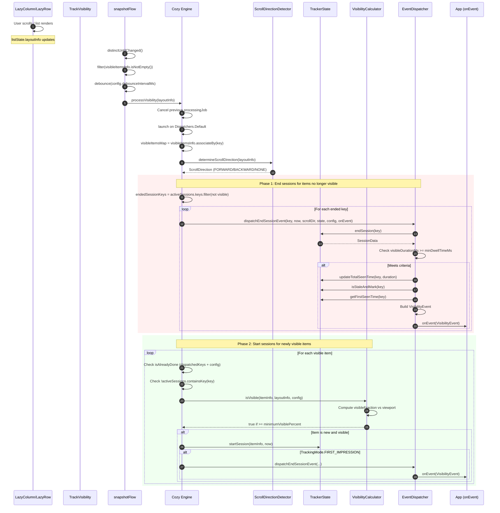
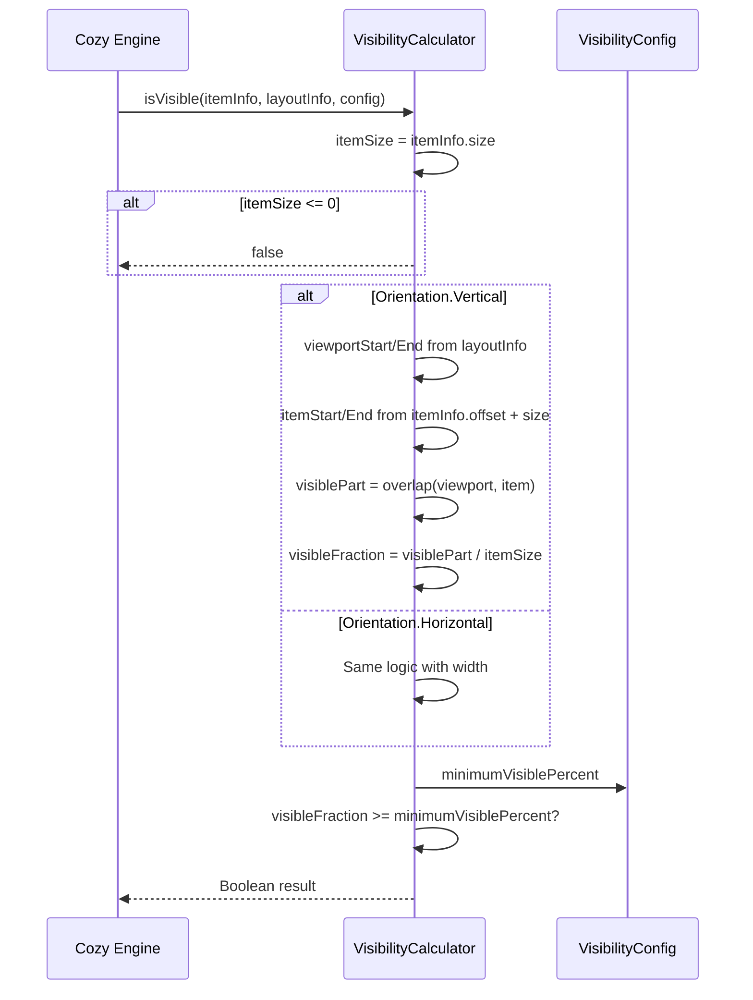
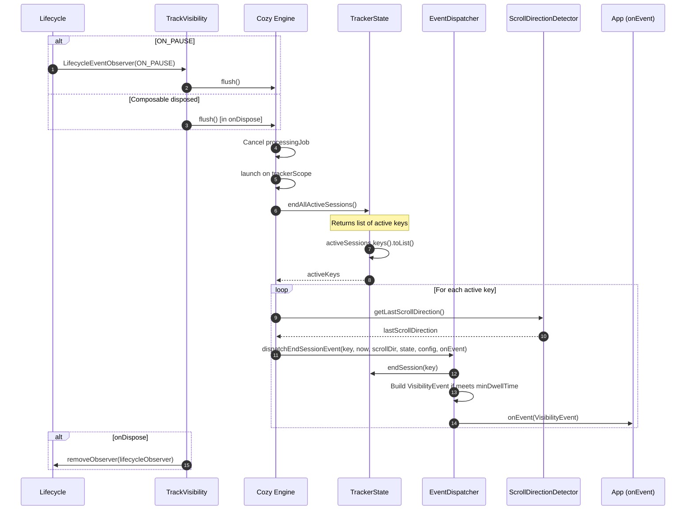

An Android library to track lazyColumn and lazyRow view time.


# CozyTracker Library — Sequence Diagrams

A detailed sequence diagram documenting the flow of the `cozy_tracker` library for Jetpack Compose `LazyList` visibility tracking.

---

## 1. Initialization Flow

How the tracker is set up when a Composable uses `rememberCozyListState`.



---

## 2. Layout Change → Visibility Processing (Main Flow)

When the user scrolls, layout info changes flow through the pipeline.



---

## 3. Visibility Calculation Detail

How `VisibilityCalculator` determines if an item is "visible."



---

## 4. Lifecycle: Flush (ON_PAUSE / onDispose)

When the app goes to background or the Composable is disposed.



---

## 5. Component Overview

```
┌─────────────────────────────────────────────────────────────────────────────┐
│                              App / Consumer                                  │
│  rememberCozyListState(onEvent, config) → LazyListState                      │
└─────────────────────────────────────────────────────────────────────────────┘
                                        │
                                        ▼
┌─────────────────────────────────────────────────────────────────────────────┐
│                         CozyListState (Composable)                           │
│  - Creates LazyListState                                                     │
│  - Builds Cozy via Builder                                                   │
│  - Renders TrackVisibility(listState, tracker)                               │
└─────────────────────────────────────────────────────────────────────────────┘
                                        │
                    ┌───────────────────┴───────────────────┐
                    ▼                                       ▼
┌──────────────────────────────┐        ┌──────────────────────────────────────┐
│    TrackVisibility           │        │           Cozy (Engine)               │
│  - snapshotFlow(layoutInfo)  │───────▶│  - processVisibility(layoutInfo)      │
│  - debounce, filter          │        │  - flush()                            │
│  - Lifecycle observer        │        │  - TrackerState, ScrollDirectionDetector│
│  - ON_PAUSE → flush          │        │  - VisibilityCalculator, EventDispatcher│
└──────────────────────────────┘        └──────────────────────────────────────┘
                                                          │
                        ┌─────────────────┬───────────────┼───────────────┐
                        ▼                 ▼               ▼               ▼
            ┌───────────────┐  ┌──────────────┐  ┌─────────────┐  ┌──────────────┐
            │ TrackerState  │  │ScrollDir     │  │ Visibility  │  │   Event      │
            │ - activeSess  │  │ Detector     │  │ Calculator  │  │ Dispatcher   │
            │ - totalSeen   │  │ - direction  │  │ - isVisible │  │ - dispatch   │
            │ - firstSeen   │  │              │  │             │  │   EndSession │
            │ - dispatched  │  │              │  │             │  │              │
            └───────────────┘  └──────────────┘  └─────────────┘  └──────────────┘
```

---

## 6. Data Flow Summary

| Stage        | Input                          | Output                          |
|-------------|---------------------------------|----------------------------------|
| Init        | `onEvent`, `VisibilityConfig`   | `Cozy` instance, `LazyListState` |
| Layout      | `LazyListLayoutInfo`           | `snapshotFlow` emission          |
| Debounce    | Flow emission                  | Single `layoutInfo` after idle   |
| Process     | `layoutInfo`                   | `VisibilityEvent`s via `onEvent` |
| End Session | `key`, `SessionData`           | `VisibilityEvent` (if minDwell)  |
| Flush       | Lifecycle / Dispose            | End all sessions → events        |
